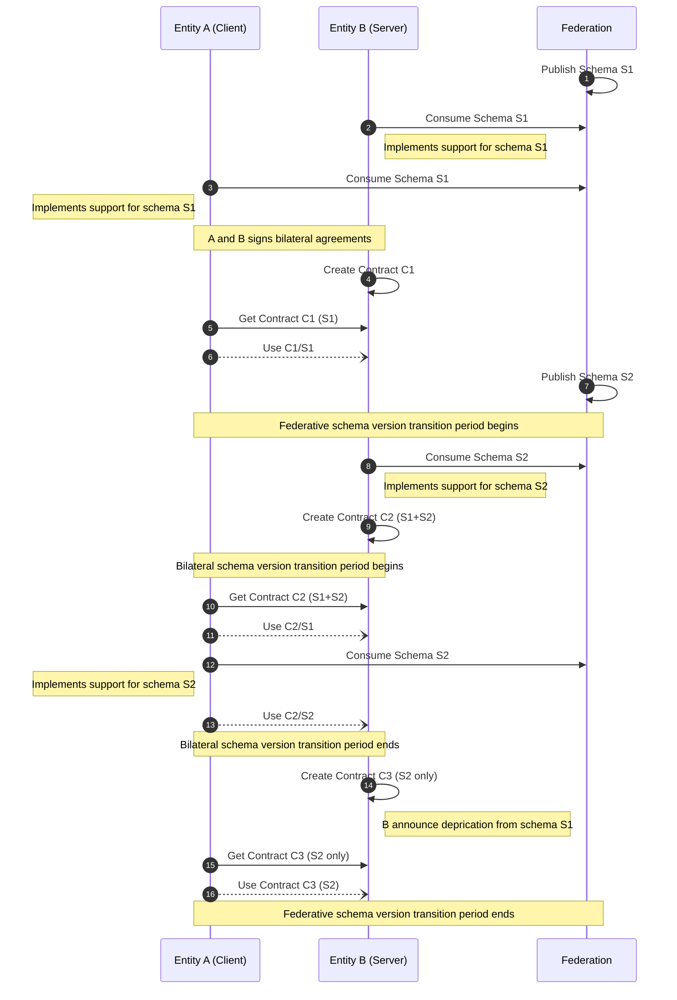

# Handling Bilateral Contracts

This convention governs the lifecycle, override logic, and schema transition behavior for bilateral contracts exchanged between participants in the FFI federation. It ensures synchronized schema transitions, prevents fragmentation, and clarifies how contracts are maintained between specific party pairs.

## General Principles

- A bilateral contract governs the interaction between **exactly one client (requestor)** and **one server (respondent)**.
- Each **server defines** which client the contract applies to—**one contract per client**.
- If a server communicates with multiple clients, it must maintain **separate contracts** for each.
- Only one **active** contract exists for any given server-client pair at a time.
- Contracts are **not versioned**. When replaced, the new contract overrides the previous one.
- The Contract API always returns the **current active** contract for the calling client.

## Override and Replacement Behavior

- A newly created contract for the same client **automatically overrides** the previous one.
- Contracts are always authored and published by the server for a specific client.
- Each contract must have a unique `contractId` (UUID).
- Contracts are immutable after issuance—updates require the creation of a new contract.
- Clients retrieve their active contract via the Contract API and must comply with its contents.

## Schema Evolution and Transition

Schemas (e.g., S1, S2) are published centrally by the federation and define the structure of message payloads. New schema versions require corresponding updates to bilateral contracts to enable phased adoption across participants.

### Federative vs. Bilateral Transition Periods

- The **federation** defines a global **schema transition period** during which new and old schema versions may coexist across the network.
- Each **bilateral relationship** follows its own **contract-level transition**, reflecting when the server creates a contract that includes both schema versions and the client begins consuming it.

### Transition Timeline

1. The federation publishes a new schema version (e.g., S2).
2. The **federation schema transition period begins**.
3. The server implements S2 and creates a new contract (e.g., C2) for the client that includes both S1 and S2.
4. The client continues using S1 but retrieves and uses the new contract (C2).
5. The client implements S2 and transitions to using the new schema under the same contract.
6. The server eventually issues another contract (e.g., C3) that supports only S2 to mark removal of S1.
7. Once all bilateral transitions complete, the federation **ends the transition period** and formally deprecates S1.

### Coexistence of Schemas

- A contract may declare support for **multiple schema versions** per message type in its `schemaVersions` field.
- This enables staggered adoption and minimizes disruption across the federation.
- Participants are expected to transition their schema usage while adhering to their active bilateral contract.

### Finalization and Deprecation

- Schema deprecation is handled by issuing new contracts that exclude deprecated versions.
- Deprecation of a schema at the federation level mandates that future contracts **must not** include that version.
- Once the federative transition period ends, all members must operate using contracts aligned with current schema standards.

## Federation-Specific Parameters

Defined in the **FFI Federation Configuration Document**:

- **Federative Schema Transition Period** – The centrally defined maximum period during which two schema versions (e.g., S1 and S2) are allowed to coexist across the federation. This sets the upper time limit for all members to complete schema migration.
- **Bilateral Transition Period** – The time span between when a server issues a new contract supporting a new schema and when both parties are expected to fully operate on that new schema. This period varies per server-client relationship and must fit within the federative limit.

Refer to the **FFI Federation Configuration Document** for authoritative parameter values.

## Enforcement and Compliance

- Clients and servers **must comply** with the terms of the active contract in place.
- Using deprecated or unsupported schemas, or failing to update contracts during transition periods, may trigger the **incident management process**.
- Persistent violations may lead to temporary or permanent restrictions on contract exchange or federation participation.

## Visual Example: Schema and Contract Evolution

